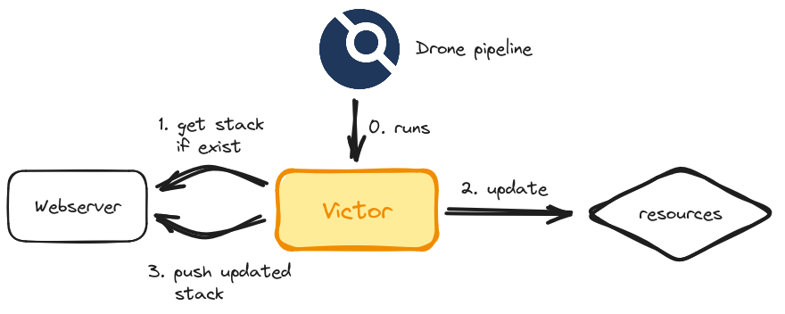

<div align="center">
    <h1>Victor</h1>
    <p><b>Victor is always here to assist you through continuous deployment, and especially<br>when updating and storing Pulumi stack states in webservers through a Drone pipeline.</b><p>
    <a href="https://pkg.go.dev/github.com/ctfer-io/victor"></a>
	<a href="https://goreportcard.com/report/github.com/ctfer-io/victor"></a>
	<a href="https://coveralls.io/github/ctfer-io/victor?branch=main"></a>
	<br>
	<a href=""></a>
	<a href="https://github.com/ctfer-io/victor/actions?query=workflow%3Aci+"></a>
	<a href="https://github.com/ctfer-io/victor/actions/workflows/codeql-analysis.yaml"></a>
    <br>
    <a href="https://securityscorecards.dev/viewer/?uri=github.com/ctfer-io/victor"></a>
</div>

## How to use

You can drop the following into your Drone pipeline (`type: docker`).

```yaml
steps:
  - name: victor
    image: ctfer-io/victor:latest
    settings:
      # Webserver related options
      statefile: https://my-webserver.dev/project.stack.state
      username:
        from_secret: WEBSERVER_USERNAME
      password:
        from_secret: WEBSERVER_PASSWORD
      # Pulumi related options
      passphrase:
        from_secret: PULUMI_CONFIG_PASSPHRASE
      context: ./deploy
      resources:
        - "kubernetes 3.29.1"
        - "random 4.13.2"
      server: https://my-webserver.dev/pulumi
      outputs: outputs.json
    # Specific environment variables that fit your context (e.g. offline)
    environment:
      MY_VAR1: "my_value"
      MY_VAR2:
        from_secret: MY_VAR2
```

## How it works

The following resumes what Victor does for you.

<div align="center">
  
</div>

Here are more explanation:
 1. **Get stack if exist**: Victor create a new Pulumi workspace in your Drone pipeline, then create a stack, and if the webserver contains a state file, loads it. This enable the following to work properly.
 2. **Update**: by comparing the existing and actualised resources (does a refresh first) to the target, Victor enable fine-grained continuous deployment of your resources.
 3. **Push updated stack**: finally, Victor exports the stack state file and uploads it in the webserver such that future iterations will be able to load it, to really do **continuous** deployment.

## Why using it ?

So why doing it with a Drone plugin rather than using multiple steps ?

<p align="center">✨ <b>Simplicity</b> ✨</p>

Using this plugin, you ease your Continuous Deployments from a Drone pipeline, without the need to maintain plugin updates, stack import and export, basic authentication handling...
Yes you can work without it, but why not simplify your job and focus on the **real** business value ?
